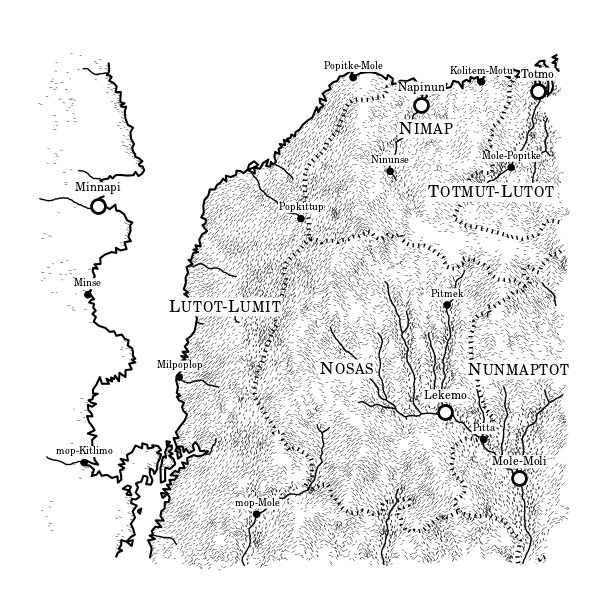
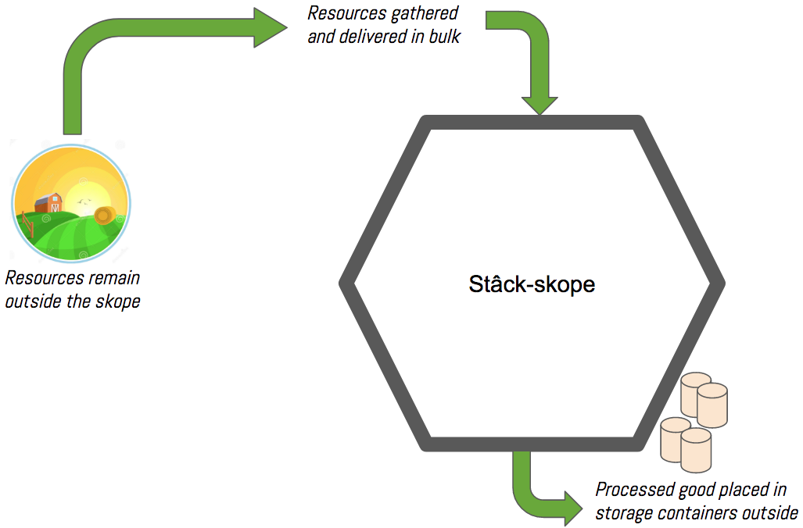
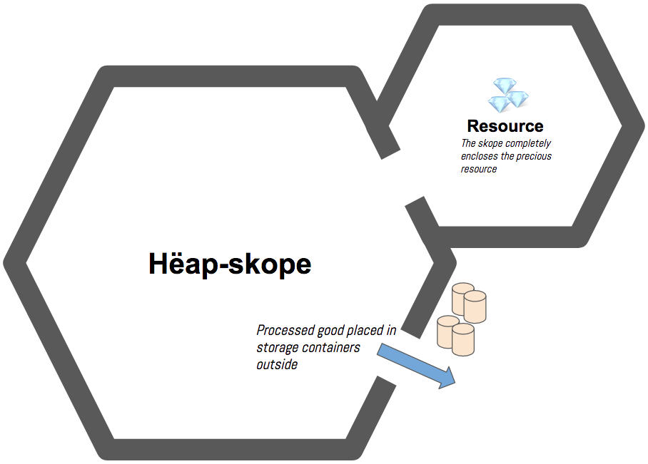

## Lexscopistan

> **Objective:** This exercise will have you creating many different _kinds_ of scope and several levels of nesting (i.e. scopes within scopes). It should provide you with many opportunities to access variable in an outer scope, and see how you are prevented from accessing variables in an inner scope.

Welcome to Lexscopistan. A country filled with rich forests, steep mountains, fertile plains, and powerful rivers.



The people of Lexscopistan are primarily a nomadic people, with only a handful of permanent settlements and cities. It's capital is Nimap on the northern coast, with a port on the Sea of Mole-Lomit.

Lexscopistanians excel at being able to construct, tear down, and quickly move small, modular settlements they call *skopes*. The purpose of a skope is to process natural resources - timber, minerals, game for meat & furs, water, and crops.

Lexscopistanians set up a skope in 1-3 days, including a large, modular wooden barricade surrounding it. This protects them from wild predators and strong winds. Nothing can penetrate this barricade, as it is made out of wood from the *likmura* tree, reknowned for its strength and longevity once treated.

Inside, the Lexscopistanians erect workshops, forges, and living spaces to be used while they gather and process a resource. Right outside the barricade, always on the southern side, large storage containers are used to store the processed goods. Each storage container can hold 21 bushels of food, 150 gallon of water, 15 logs of wood, 565 kilograms of minerals & gems, or 85 furs.

There are two types of skopes.

## **Stâck-skope**



This type is smaller, and more mobile, and is used to very quickly gather renewable resources like water and game. An stâck-skope usually only stays constructed in a single location for a few days before it is deconstructed and moved.

Stâck-skopes are equipped with 10 storage containers.


## **Hëap-skope**



This type is larger, sturdier, and is used to not only enclose the workshops and living spaces for Lexscopistanians, but also the resource they are gathering. A hëap-skope is used for processing timber and minerals which can take weeks, or sometimes, months to gather and process.

Hëap-skopes are equipped with 30 storage containers.

## Resource Collecting Application

Your job is to build code representations of resources and skopes to process those resources. Let's look at an example.

### Stâck-skope Operations

```js
/*
    Generator functions can be used to generate a value, or object,
    on demand, until a certain condition is met. The function below
    defines a generator for crop storage containers. Since stack skupes
    are used to collect crops, and they use 10 storage containers,
    instances of this generator will stop producing containers after the
    10th one.
*/
const cropContainerGenerator = function* () {
    let currentContainer = 1
    const maximumContainers = 10

    while (currentContainer <= maximumContainers) {
        yield { "id": currentContainer, "type": "Crop", "bushels": [] }
        currentContainer++
    }
}

/*
    Create an instance of the crop container generator function.
    `cropContainerFactory` will generate 10 containers.

    > cropContainerFactory.next().value
    { "id": 1, "type": "Crop", "bushels": [] }

    > cropContainerFactory.next().value
    { "id": 2, "type": "Crop", "bushels": [] }

    etc..
*/
const cropContainerFactory = cropContainerGenerator()

/*
    A field containing four types of crops to process
    It exists outside of the stack skope.
*/
let agriculturalField = [
    {
        "type": "Corn",
        "plants": 368
    },
    {
        "type": "Wheat",
        "plants": 452
    },
    {
        "type": "Kale",
        "plants": 212
    },
    {
        "type": "Turnip",
        "plants": 84
    }
]

/*
    Create a skope function to process each tree.

    Lexscopistanian food processors can produce 1 bushel of a
    crop for every 22 plants
*/
const cropStackSkope = function (rawCrops) {
    /*
        Use the array map() method to build up a new array
        populated with processed crops. Remember that the map
        method iterates over an array, one item at a time,
        and runs the logic in the provided function on each
        iteration.
    */
    const processedCrops = rawCrops.map(
        /*
            For each crop, return a new object representing
            the bushels to store in the containers.

            This is an example of an arrow function with an
            expression body.
                https://mzl.la/1rrAsL3
        */
        currentCrop => ({
            "type": currentCrop.type,
            "bushels": Math.floor(currentCrop.plants / 22)
        })
    )

    /*
        `processedCrops` is only available within the block
        scope of this function
    */
    return processedCrops
}

/*
    Remember that JavaScript is object-oriented, so everything
    is an object - including functions. Since functions are
    objects, then you can add key/value pairs to them
*/
cropStackSkope.containers = []


/*
    Construct the skope, and import all of the gathered
    resources to be processed. The end result is a collection
    of bushels that need to be stored.

    a.k.a.
    Invoke the function, and store its return value - an array
    of objects - in the `allBushels` variable.
*/
let allBushels = cropStackSkope(agriculturalField)


/*
    Now that the crops have been processed into bushels, you
    need to place them in the storage containers. Keep in mind
    that storage containers can hold 21 bushels of food.

    1. Open the first container by invoking the `cropContainerFactory`
       generator function.
    2. Iterate over the `allBushels` array
    3. Look at each object, which holds information about the type of
       resource, and how many bushels were produced, and get the value
       of the `bushels` property
    3. Do a `for` loop that iterates up to that value
    4. Insert a new object into a storage container. The object
       should describe the type of bushel.

         e.g. { "crop": "Wheat" }

    5. Make sure you keep count of how many bushels are in the
       container, and once it reaches 21, start placing the
       objects in the next container.
*/

// Open the first container
let currentContainer = cropContainerFactory.next().value

// Iterate over the `allBushels` array
allBushels.forEach(

    // Look at each processed crop object
    currentBushel => {

        // Do a `for` loop that iterates up to number of bushels
        for (let i = 0; i < currentBushel.bushels; i++) {

            // Insert a new object into a storage container
            const bushel = {"type": currentBushel.type}
            currentContainer.bushels.push(bushel)

            // Once capacity is reached, use next storage container
            if (currentContainer.bushels.length === 21) {
                cropStackSkope.containers.push(currentContainer)
                currentContainer = cropContainerFactory.next().value
            }
        }
    }
)


/*
    Try to console.log() any of the values defined in the block scope
    above, such as `i`, `bushel`, or `currentBushel`
*/


/*
    If there is a partially filled container left over, add it to the
    collection of skope storage containers.
*/
if (currentContainer.bushels.length > 0) {
    cropStackSkope.containers.push(currentContainer)
}

// Take a look at what's in your containers
console.log(cropStackSkope.containers)
```

### Hëap-skope Operations

Hëap-skopes contain the resource they are processing inside the barricade, so their representation in code looks a bit different.

```js
const gemHeapSkope = function () { // No parameter needed
                                   // Resource contained inside


    /*
        The gem mine does not exist outside the barricade of the
        hëap-skopes. The Lexscopistanians build the barricade
        around their facility AND the resource.

        a.k.a.
        Instead of being located in an outer scope to the
        function, the gem mine is enclosed by the scope of
        the `gemHeapSkope` function.
    */
    const GemMine = {
        "Onyx": {
            "kilograms": 453
        },
        "Amethyst": {
            "kilograms": 453
        },
        "Bloodstone": {
            "kilograms": 453
        },
        "Emerald": {
            "kilograms": 453
        }
    }

    /*
        Instead of processing the entirety of the resources in
        bulk - which is what the stâck-skope does - this skope
        will return an object that has a method for processing
        each type of mineral.

        We're exposing the functionality of this skope to code
        in the outer scope, so that the order in which minerals
        are processed can be customized.

        Hëap-skopes workshops can process 5 kilograms of a
        mineral with each work order. So every time the `process`
        function is invoked, subtract 5 from the amount of the
        requested mineral from the enclosed GemMine above.
    */
    return {
        "process": function (requestedMineral) {
            /*
                Subtract 5 from the total kilograms available in
                the gem mine, but make sure you stop when there
                are no minerals left.
            */
            if ( /* 5kg, or more, of the mineral remaining? */ ) {
                /*
                    You can reference the `GemMine` variable here
                    because it lives in an outer scope:
                      e.g. GemMine[requestedMineral].kilograms
                */
            }

            return {
                "mineral": requestedMineral,
                "amount": 0 // Change this to the correct amount
            }
        }
    }
}

/*
    The SkopeManager variable represents the object with the
    `process` method on it.
*/
const SkopeManager = gemHeapSkope()

/*
    Process the gems in any order you like until there none
    left in the gem mine.
*/


/*
    Create a generator for 30 storage containers, which is how many a hëap-skope
    is equipped with.
*/


/*
    Place the gems in the storage containers, making sure that
    once a container has 565 kilograms of gems, you move to the
    next one.
*/
```

## Final Result


## Do You Understand Scope

### Build Your Own Stâck Skope

You are now in charge of building another Stâck Skope whose job is to go to the nearest forest and process the 37 trees available to convert into logs. Lexscopistanian food processors can produce 4 usable logs from every tree.

1. There are 9 trees of Oak available
1. There are 12 trees of Pine available
1. There are 6 trees of Ash available
1. There are 10 trees of Balsa available

Define the forest. Refer to the agricultural field defined above for guidance.

```js
const forest = []
```

Define your Stâck Skope.

```js
const cropStackSkope = function (trees) {
    // Functionality to convert each tree into 4 logs

    // Start filling up the 10 available storage containers
}
```

### Build Your Own Hëap Skope

Now buildi another Hëap Skope whose job is to go to the nearest mountain, where our geologists have discovered that we can build 2 mines. They must be separate mines because the veins originate on opposite sides of the mountain. One mine will produce iron, and copper. The other mine will produce gold, and coal.

The geologists have detected the following amounts in each mine.

#### Mine 1

1. There is 5302kg of coal
1. There is 2775kg of gold

#### Mine 2

1. There is 3928kg of iron
1. There is 901kg of copper

Remember, Hëap Skopes enclose all of the resources they are in charge of processing.